# Xilinx ISE 14.7 Installation Guide (Windows 11 + WSL2 + Docker)

**Author:** Mehmet Gök
**Institution:** Boğaziçi University Department of Electrical & Electronics Engineering
**Document Date:** February 28, 2026
**Revision:** 1.0

---

## 1. Prerequisites and Setup

* Install Visual Studio Code from the Microsoft Store or download it from: `https://code.visualstudio.com/download`
* Open VS Code. From the top menu, click on “Terminal” and select “New Terminal.”
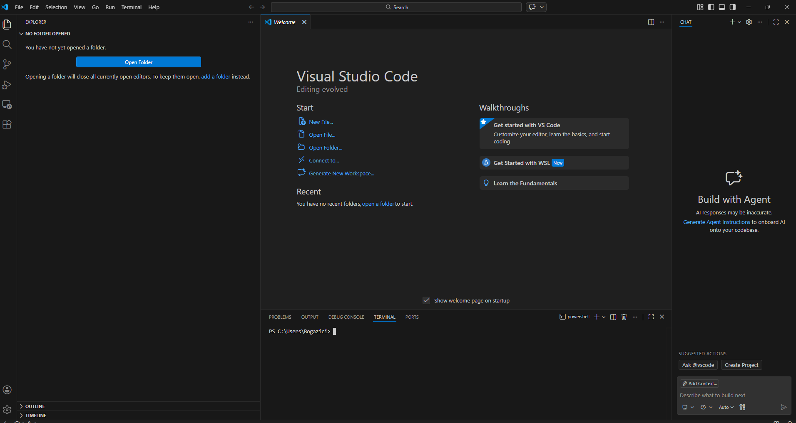

* In the terminal, type:
  * `wsl --install`
  * This process may take some time.
* After installation completes, reboot your system. Open the VS Code again and create a new terminal.
  * Run the following command: `wsl --install -d Ubuntu`
  * Ubuntu will be installed. You will be prompted to create a username and password.
* Download Docker Desktop for Windows from: `https://docs.docker.com/desktop/setup/install/windows-install/` During installation, make sure the WSL2 option is enabled.
* Restart your PC after installation.

## 2. Downloading Xilinx ISE 14.7

* Download Xilinx ISE 14.7 from: `https://www.xilinx.com/support/download/index.html/content/xilinx/en/downloadNav/vivado-design-tools/archive-ise.html` Create a free account and download: `Xilinx_ISE_DS_Lin_14.7_1015_1.tar` (Full Linux installer)
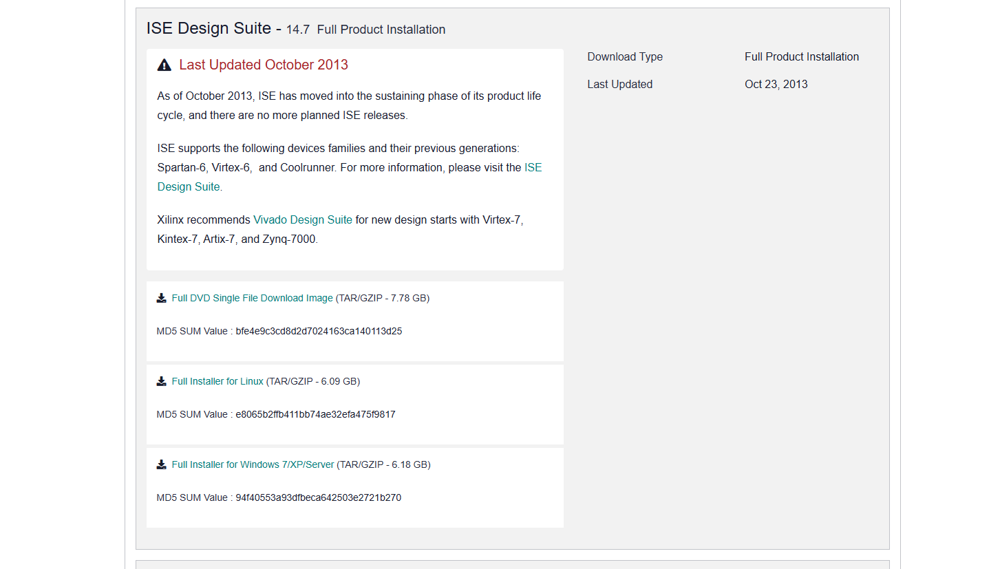
* Also generate a license file from:
* `https://account.amd.com/en/forms/license/license-form.html`
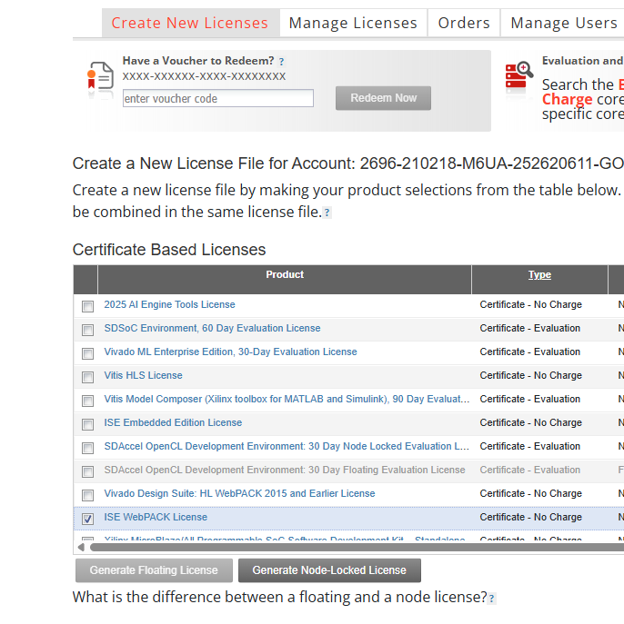
* Select “ISE WebPack” and generate a node-locked license.
* The license file will be sent to your email. 
* if you can't file here go to manage licenses and download from there

## 3. Docker Configuration

* Open Docker Desktop → Settings → Resources → WSL Integration. Enable Ubuntu integration and click “Apply & Restart.”
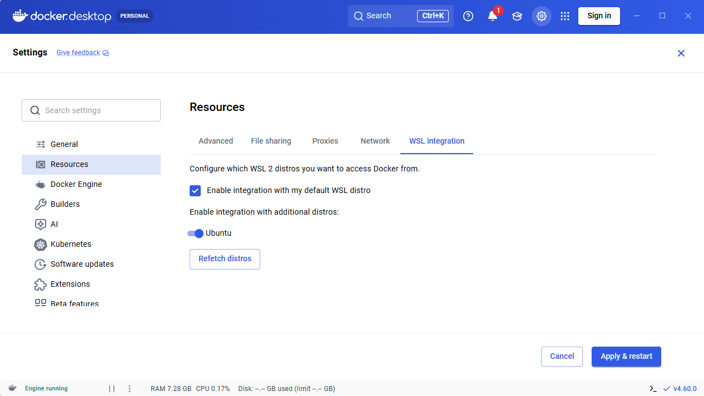
* In VS Code, open a terminal and type:
  * `wsl`
* You are now inside Ubuntu. Copy the installer:
  * `cd` #this will take you to home of ubuntu user
  * `cp /mnt/c/Users/`<**YourUsername**>`/Downloads/Xilinx_ISE_DS_Lin_14.7_1015_1.tar .`
* Copy the license file:
  * `cp /mnt/c/Users/`<**YourUsername**>`/Downloads/Xilinx.lic .`
* Verify files using (type in the terminal):
  * `ls`
* Verify Docker using (type in the terminal):
  * `docker --version`

## 4. Workspace Creation and Dockerfile

* Create working directory:
  * `mkdir -p ~/tools/ISE`
  * `mv ~/Xilinx* ~/tools/ISE/`
  * `cd ~/tools/ISE`
* Create a Dockerfile by simply copy pasting below in terminal:
  * `cat <<EOF > Dockerfile`
  * `# Use Ubuntu 16.04 (Compatible with ISE era tools)`
  * `FROM ubuntu:16.04`
  * `# Enable 32-bit architecture (ISE is a 32-bit app disguised as 64-bit)`
  * `RUN dpkg --add-architecture i386`
  * `# Install dependencies (Fixes missing library errors like libXi.so, libXrender, etc.)`
  * `RUN apt-get update && apt-get install -y \`
  * `build-essential \`
  * `git \`
  * `sudo \`
  * `locales \`
  * `libx11-6 libx11-6:i386 \`
  * `libglib2.0-0 libglib2.0-0:i386 \`
  * `libsm6 libsm6:i386 \`
  * `libxrender1 libxrender1:i386 \`
  * `libfontconfig1 libfontconfig1:i386 \`
  * `libxext6 libxext6:i386 \`
  * `libxi6 libxi6:i386 \`
  * `libxrandr2 libxrandr2:i386 \`
  * `libxcursor1 libxcursor1:i386 \`
  * `libxinerama1 libxinerama1:i386 \`
  * `libxft2:i386 \`
  * `libxtst6:i386 \`
  * `libncurses5:i386 \`
  * `libstdc++6:i386 \`
  * `xutils-dev \`
  * `&& rm -rf /var/lib/apt/lists/*`
  * `# Create a 'developer' user to avoid running as root`
  * `RUN useradd -m -s /bin/bash developer && \`
  * `echo "developer ALL=(ALL) NOPASSWD:ALL" > /etc/sudoers.d/developer`
  * `# Set Locale`
  * `RUN locale-gen en_US.UTF-8`
  * `ENV LANG en_US.UTF-8`
  * `ENV LANGUAGE en_US:en`
  * `ENV LC_ALL en_US.UTF-8`
  * `USER developer`
  * `WORKDIR /home/developer`
  * `EOF`
* Type “ls“ you should see Dockerfile if everything corrects
* Build Docker image (type below in terminal with order):
  * `sudo usermod -aG docker $USER`
  * `newgrp docker`
  * `docker build -t ise-14.7 .    #will take time do not forget “.” At the end`
  * `mkdir -p ~/xilinx-install`
  * `sudo apt update && sudo apt install x11-xserver-utils -y`
  * `xhost + #type your password if ask`

## 5. Installing Xilinx ISE Inside Docker

* Run the installer inside Docker
* -------------------------command starts--------------------------- 
* `docker run -it --rm --net=host -e DISPLAY=$DISPLAY -v /tmp/.X11-unix:/tmp/.X11-unix -v $(pwd)/Xilinx_ISE_DS_Lin_14.7_1015_1.tar:/installer.tar -v ~/xilinx-install:/opt/Xilinx ise-14.7 bash -c "tar -xf /installer.tar; cd Xilinx_ISE_DS_Lin_14.7_1015_1; ./xsetup"`
* -------------------------command ends---------------------------

  this will take time, if everything successful you will see
  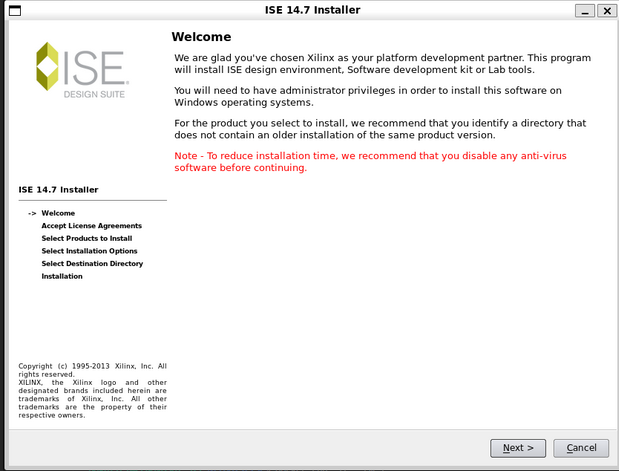
  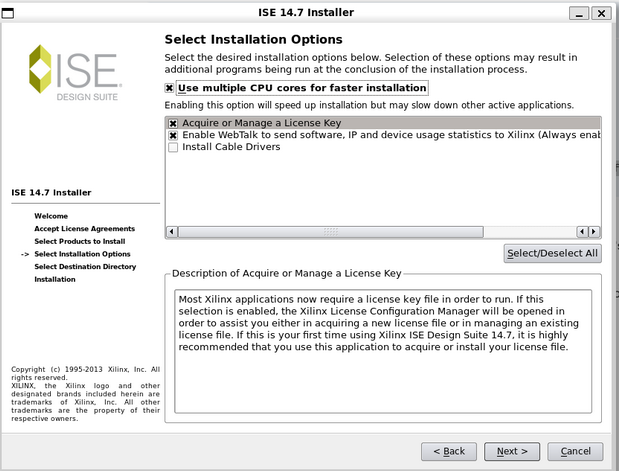
* Do NOT install cable drivers.
  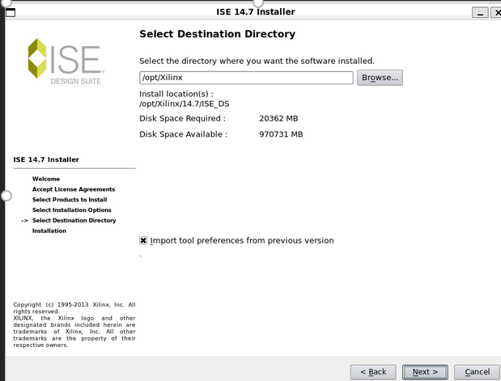
* After above finished we need to get our license simply copy paste below
  * be sure you are still in `~/tools/ISE/`
  * `cp Xilinx.lic ~/xilinx-install/`
* after this simply copy the below command
* -------------------------command starts---------------------------
  * `alias ise='xhost +local:docker > /dev/null; docker run -it --rm --net=host -e DISPLAY=$DISPLAY -e XILINXD_LICENSE_FILE=/opt/Xilinx/Xilinx.lic -v /tmp/.X11-unix:/tmp/.X11-unix:rw -v $HOME/xilinx-install:/opt/Xilinx -v $(pwd):/work -w /work ise-14.7 bash -c "source /opt/Xilinx/14.7/ISE_DS/settings64.sh && ise"'`
* -------------------------command ends---------------------------
* Then you can type
  * `ise`
* then terminal leaves and gui will welcome you as below :
  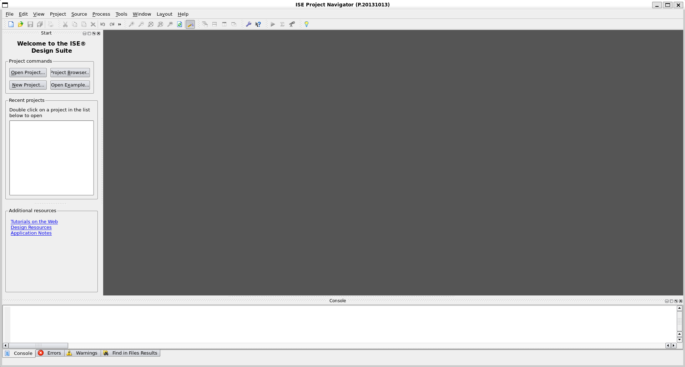
* This is the main place we develop our hdl codes.

## 6. Creating FPGA Projects

* I strongly suggest creating separate folder for this projects like simply type `mkdir -p ~/fpga_project`
* `Cd ~/fgpa_project`
* Type `ise` afterwards projects will be created in this folder
* Note: every time you open wsl first it will open terminal at /mnt/c…. kind of place
* Simply write `cd` and enter it will guide you to ubuntu home directory.

## 7. Connecting Hardware (Digilent Adept)

* Switch back to host machine your windows version and go to site below:
* `https://digilent.com/reference/software/adept/start?srsltid=AfmBOoownrZvrs34LBzzZEgiPC7cWKAD4nv8F__mhaoblDF1wesVRRA5`
* download windows version of digilent adept2 from this link
* 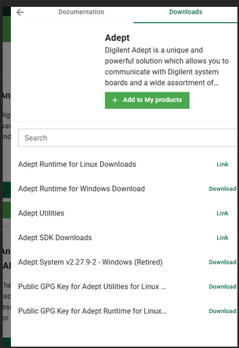
* V2.27.9-2 retired And install it by click next next next
* After this simply type adept in windows search bar
* 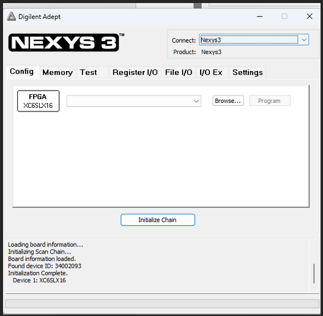
* Connect nexsys via usb to pc it should show up as above and from here you can simply upload .bit files
* But here comes to question how can I found my bit files which is inside wsl
* Simply say browse in above screen
  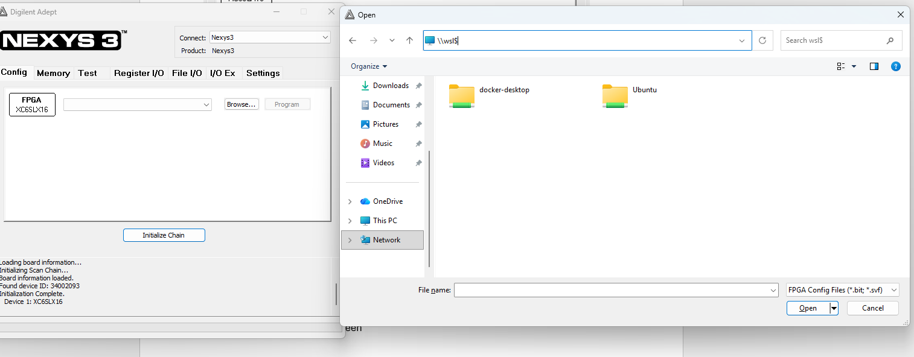
* double click in search bar and type `\\wsl$` then enter u can see wsl distros there open ubuntu-> home -> Bogazici -> wherever path you put your project
* Bogazici in your case will be your username
* Upload and run
* Congrats. Done should be light up near red button.

